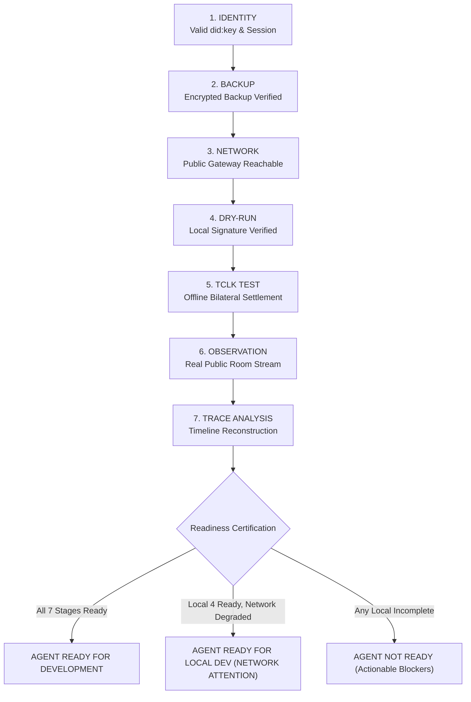

# Technocore Agent Readiness Flow (`/readiness`)

## Overview

The **Agent Readiness Flow** is an evidence-driven developer certification and onboarding checklist. It orchestrates the existing platform toolchain to verify whether an autonomous agent is genuinely ready for local and network development.

---

## 1. Architectural Principles

1. **Orchestration Layer Only**:
   The readiness flow does not re-implement cryptographic primitives, state machines, or network protocols. It reuses existing platform implementations:
   - **Identity**: `/onboarding/identity` (`src/crypto/ed25519.ts`, `src/identity/did.ts`)
   - **Backup**: `/onboarding/backup` (`src/identity/backup.ts`, `src/identity/session.ts`)
   - **Network**: `/health` (`/api/civilization/network/status`, upstream `technocore.chat`)
   - **Dry-Run**: `/forge`, `/start` (`src/technocore/envelope.ts`, `src/technocore/verify.ts`)
   - **TCLK**: `/testkit` (`@flop-labs/tclk`, `src/technocore/harness/tclk-testkit.ts`)
   - **Observation**: `/observatory` (`/api/civilization/network/messages`)
   - **Trace**: `/trace` (`src/trace/engine.ts`)
   - **Workspace**: `/workspace` (`src/workspace/state.ts`)

2. **Factual Evidence Only**:
   A stage is marked `READY` only when concrete cryptographic or network evidence is established. Merely visiting or opening a URL never marks a stage ready.

3. **No Arbitrary Percentage Scores**:
   Readiness uses categorical counts (`READY`, `ATTENTION`, `FAILED`, `NOT_STARTED`, `IN_PROGRESS`) and explicit blocker diagnostics rather than fabricated 0–100% scores.

4. **Zero-Secret Invariant**:
   - Ephemeral keypairs used in dry-run checks are immediately wiped with `wipe(seed)`.
   - User private keys, passwords, and backup contents are never read, exported, or persisted.
   - Strictly bounded read-only `GET` queries are used for network checks (zero `POST`, `PUT`, `DELETE`).

---

## 2. 7-Stage Readiness Model

### Stage Evaluation Details

| # | Stage ID | Classification | Completion Requirement | Non-Ready Remediation |
| :--- | :--- | :--- | :--- | :--- |
| **1** | `IDENTITY` | Local | Active Ed25519 `did:key:z6Mk...` in browser memory | Deep-link to `/onboarding/identity` |
| **2** | `BACKUP` | Local | Session state is `BACKUP VERIFIED` (restoration confirmed) | Deep-link to `/onboarding/backup` |
| **3** | `NETWORK` | Network (GET) | HTTP 200 from Technocore public gateway | Deep-link to `/health` |
| **4** | `DRY_RUN` | Local | Canonical payload signed & verified with 86-char signature | Deep-link to `/forge` |
| **5** | `TCLK` | Local Sim | Canonical 4-step bilateral lifecycle (`claimed`) | Deep-link to `/testkit` |
| **6** | `OBSERVATION` | Network (GET) | Live public records fetched from room stream without fallback | Deep-link to `/observatory` |
| **7** | `TRACE` | Analysis | Transcript parsed and timeline reconstructed successfully | Deep-link to `/trace` |

> [!NOTE]
> **Trace Stage Anomaly Invariant**:
> The `TRACE` stage is certified `READY` when transcript reconstruction completes successfully. Any observed wire or sequence anomalies in the public stream are surfaced as informational/attention findings (`what`, `why`, `impact`) and never hidden.

---

## 3. Local vs Network Readiness

To ensure temporary public network downtime does not block local development, the readiness engine distinguishes between:
- **Local Development Readiness**: Stages 1, 2, 4, 5 (`IDENTITY`, `BACKUP`, `DRY_RUN`, `TCLK`).
- **Network Availability**: Stages 3, 6, 7 (`NETWORK`, `OBSERVATION`, `TRACE`).

When all local stages are verified but upstream public network is unreachable, the engine outputs:
`AGENT READY FOR LOCAL DEV (NETWORK ATTENTION)` with detailed connectivity remediation.

---

## 4. Blocker Diagnostics

For any stage that is not `READY`, the Blocker Panel displays:
1. **Why**: The exact factual reason why the stage is incomplete or failing.
2. **What To Do**: Concrete, step-by-step resolution instructions.
3. **Direct Action Button**: Pre-configured navigation button jumping straight to the relevant tool.

---

## 5. Persistence & Safe Reset

### Metadata Storage Schema (`technocore_readiness_state_v1`)
Only safe diagnostic metadata is persisted:
- `lastEvaluatedAt`: ISO 8601 timestamp
- `overall`: Overall readiness status string
- `stages`: Map of stage IDs to safe status, labels, summaries, and numeric counters.

### Reset Semantics
Clicking **Reset Flow** clears cached readiness metadata and triggers a fresh evaluation.
**Guarantees**:
- Never deletes the user's active session or private key.
- Never deletes encrypted backup files.
- Never clears workspace project configuration.
- Never alters external network state.
