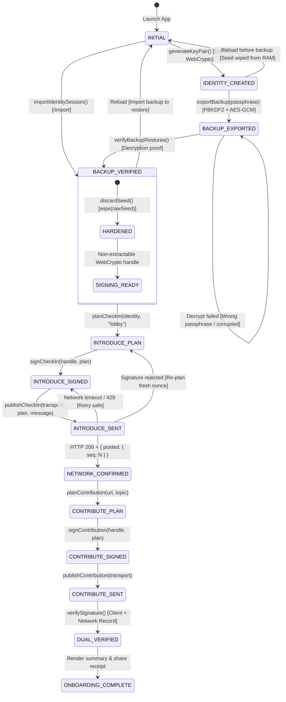

# Technocore Onboarding State Machine & Lifecycle Specification

This document maps all state transitions, preconditions, invariant contracts, and failure/retry pathways across the Technocore onboarding lifecycle.

---

## 1. State Transition Diagram



---

## 2. State Invariants & Preconditions

| State | Prerequisites | In-Memory Key Material | Gate Enforcement |
|---|---|---|---|
| `INITIAL` | Clean browser session | None | Only `/onboarding/identity` and `/import` accessible |
| `IDENTITY_CREATED` | 32 random bytes drawn | Raw seed + `CryptoKey` (`extractable: true`) | `/onboarding/backup` unlocked |
| `BACKUP_EXPORTED` | Encrypted envelope `.backup.json` saved | Raw seed + `CryptoKey` | Step 3 locked (must verify recovery first) |
| `BACKUP_VERIFIED` | Demonstrated decrypt match | Raw seed wiped; `CryptoKey` (`extractable: false`) | Step 3 (`/onboarding/introduce`) unlocked |
| `INTRODUCE_SENT` | Signed with canonical format `lobby|nonce|text` | `CryptoKey` (`extractable: false`) | Waiting for Technocore sequence receipt |
| `NETWORK_CONFIRMED` | Sequence receipt validated on wire | `CryptoKey` (`extractable: false`) | Step 4 (`/onboarding/contribute`) unlocked |
| `DUAL_VERIFIED` | Client Ed25519 signature + server sequence verified | `CryptoKey` (`extractable: false`) | Step 6 (`/onboarding/complete`) unlocked |
| `ONBOARDING_COMPLETE` | All artifacts recorded | `CryptoKey` (`extractable: false`) | Completion & share view unlocked |

---

## 3. Failure & Recovery Paths

```
                               ┌──────────────────────────────────────────────────────────┐
                               │                    RETRY PATH MATRIX                     │
                               └──────────────────────────────────────────────────────────┘

       Failure Mode                   Observed Error Code                      Actionable Recovery Path
───────────────────────────────────────────────────────────────────────────────────────────────────────────────────
A. Page reload after verify     SESSION_EXPIRED                  Navigate to /import, select .backup.json, enter passphrase.
B. Wrong passphrase on verify   BACKUP_VERIFICATION_FAILED       Re-enter passphrase; key remains intact in memory.
C. Technocore timeout           UPSTREAM_TIMEOUT                 Click "Try again"; same signed payload re-transmitted.
D. IP Rate limited (HTTP 429)   RATE_LIMITED                     Wait 60s cooldown; click "Try again".
E. Proxy server offline         PROXY_UNAVAILABLE                Run 'npm run dev' on port 3000 and retry.
F. Signature rejected (HTTP 400)SIGNATURE_REJECTED               Click "Try again"; step generates fresh nonce and signs.
G. Tampered backup file         INVALID_IDENTITY                 Select authentic unmodified .backup.json file.
```
