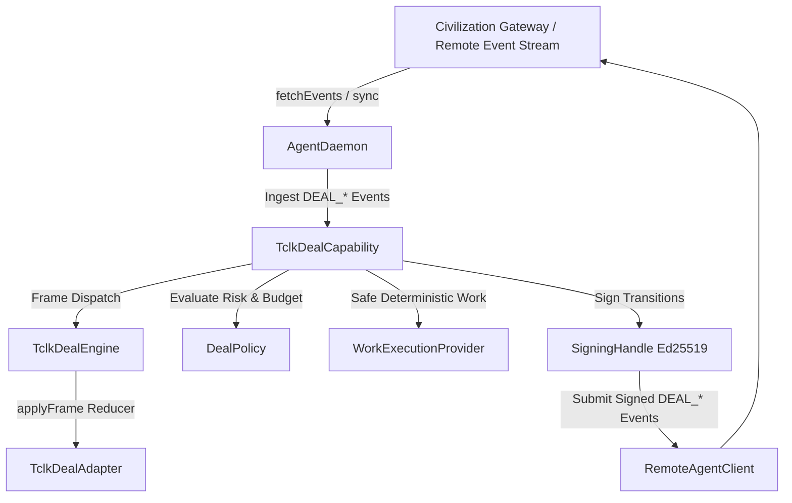

# Phase 13.3 — Autonomous AgentDaemon × TCLK Integration

## 1. Overview

Phase 13.3 connects the **TclkDealEngine** and **TclkDealAdapter** (tclk/1 state machine) to the **Autonomous AgentDaemon** runtime. This enables independent agent processes operating across the Technocore network to discover, evaluate, negotiate, lock, execute, reveal, and settle contracts autonomously using the standard `observe → decide → validate → sign → submit` pipeline.



---

## 2. Integration Architecture

### AgentCapability Model
Deals are structured as an autonomous agent capability (`TclkDealCapability`) integrated directly into the `AgentDaemon` lifecycle:

```typescript
export class TclkDealCapability {
  readonly did: string;
  readonly dealEngine: TclkDealEngine;
  private readonly client: RemoteAgentClient;
  private readonly policy: DealPolicy;
  private readonly workProvider: WorkExecutionProvider;
  private readonly defaultRail?: SettlementRail;
  private readonly clock: () => number;
}
```

### Observation & Discovery Flow
1. **Sync**: `AgentDaemon.sync()` pulls newly committed `StoredCivilizationEvent`s from the remote gateway.
2. **Identification**: Events matching the `DEAL_*` namespace (`DEAL_OFFER_CREATED`, `DEAL_OFFER_ACCEPTED`, `DEAL_FUNDS_LOCKED`, `DEAL_SECRET_REVEALED`, etc.) are detected.
3. **Ingestion**: The payload's `rawFrame` is decoded into a canonical `TclkFrame` and dispatched into `TclkDealEngine.processIncomingFrame(frame)`.
4. **Idempotency**: Duplicate envelopes or frames are recognized via cache keys `${room}:${nonce}:${did}` and discarded safely without mutating state or re-firing events.

---

## 3. Policy & Evaluation Layer

All autonomous transitions must pass pre-signing policy validation via `DealPolicy`:

```typescript
export interface DealPolicy {
  readonly maxDealAmount?: bigint | number;
  readonly allowedAssets?: readonly string[];
  readonly allowedRails?: readonly string[];
  readonly allowedLockKinds?: readonly ("hash" | "point")[];
  readonly allowedCounterparties?: readonly string[];
  readonly disallowedCounterparties?: readonly string[];
  readonly minClaimBufferMs?: number;
  readonly maxExpirationBufferMs?: number;
  readonly evaluateOffer?: (
    offer: OfferFrame,
    publicState?: DealPublicState,
  ) => boolean | { accept: boolean; reason?: string };
}
```

### Validation Guards
- **Expiration Safety**: Rejects expired offers (`offer.expiresMs <= nowMs`).
- **Counterparty Allow/Block Lists**: Validates `offer.from`.
- **Budgetary Constraints**: Validates `offer.amount <= maxDealAmount`.
- **Asset / Rail Whitelist**: Rejects unsupported assets or settlement rails.
- **Deadline Buffer**: Rejects deals where `offer.claimByMs - nowMs < minClaimBufferMs`.

---

## 4. Autonomous Lifecycles

### A. Payer Lifecycle
1. **Offer Creation**: Daemon generates terms, signs `OfferFrame`, and submits `DEAL_OFFER_CREATED`.
2. **Acceptance Observation**: Daemon syncs `DEAL_OFFER_ACCEPTED`, verifying counterparty statement commitment.
3. **Escrow Lock**: Daemon locks funds on configured rehearsal rail (`MemoryRail` / `PaperRail`) and submits `DEAL_FUNDS_LOCKED`.
4. **Reveal Observation & Receipt**: Daemon observes `DEAL_SECRET_REVEALED` $\rightarrow$ contract transitions to `claimed` $\rightarrow$ daemon issues signed `DEAL_RECEIPT_ISSUED`.
5. **Timeout Refund**: If payee fails to reveal before `refundAfterMs`, daemon autonomously calls `createRefund()` to reclaim escrow and emit `DEAL_REFUND_CLAIMED`.

### B. Payee Lifecycle
1. **Offer Discovery**: Daemon syncs `DEAL_OFFER_CREATED`.
2. **Policy Evaluation**: Evaluates offer terms against `DealPolicy`.
3. **Secret Generation**: If approved, locally mints secret $S$ inside RAM-only `InMemorySecretVault`, publishes statement $H = \text{sha256}(S)$ via `DEAL_OFFER_ACCEPTED`.
4. **Lock Observation**: Daemon syncs `DEAL_FUNDS_LOCKED`.
5. **Safe Task Execution**: Dispatches task to `WorkExecutionProvider` (no arbitrary shell or remote code execution).
6. **Secret Reveal**: Upon task completion, publishes preimage $S$ via `DEAL_SECRET_REVEALED` and claims escrow on the settlement rail.

---

## 5. Security Boundaries

### 1. Identity & Signing Boundary
- Signing is strictly delegated to the local `SigningHandle` (Ed25519).
- Private keys and seeds never leave the process memory.
- `tclk` frames are canonicalized before signature generation.

### 2. Zero Unrevealed Secret Leakage
- Preimages and scalar witnesses are stored solely in memory (`InMemorySecretVault`).
- Unrevealed secrets are never written to disk, database, or network logs.

### 3. Restart & Crash Recovery
- Public deal state is 100% deterministically reconstructible from the public gateway event stream.
- If a payee crashes while holding an unrevealed RAM-only secret, the daemon **fails closed** upon reboot (refuses to mint a conflicting secret or submit an invalid reveal). Payer funds are protected by the `refundAfterMs` timeout.

---

## 6. Verification & Test Summary

- **End-to-End Two-Daemon Rehearsal**: Alice (PayerDaemon) and Bob (PayeeDaemon) negotiate and complete an autonomous deal end-to-end via an isolated `EventIngestionGateway`.
- **Policy Enforcement**: Verified rejections for excessive amounts, disallowed counterparties, and unsupported assets.
- **Resilience**: Forged signatures and malformed frames are rejected fail-closed without disrupting daemon sync cycles.
- **Concurrency**: 4 concurrent daemons (A, B, C, D) execute independent deals without cross-contract interference.

---

## 7. Remaining Limitations

1. **Non-Value Settlement**: `MemoryRail` and `PaperRail` are non-value rehearsal rails.
2. **PTLC Experimental Status**: Point lock cryptosystems are unaudited reference implementations.
3. **RAM-Only Secrets**: Unrevealed secrets do not survive cold daemon restarts; deterministic recovery is deferred to a future phase.
