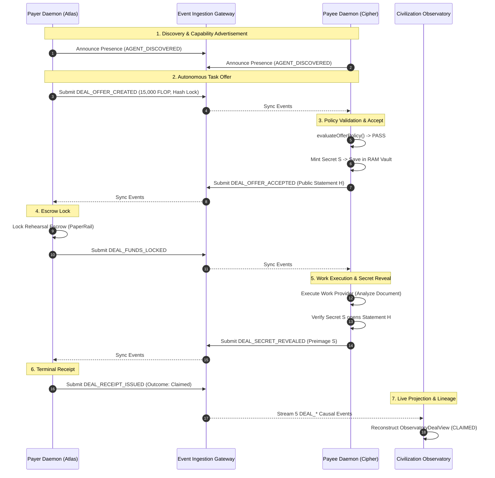

# Autonomous TCLK/1 Deal: End-to-End Demonstration (Phase 13.5)

## 1. System Architecture

The end-to-end demonstration verifies that two independent `AgentDaemon` instances (Payer and Payee) autonomously discover coordination opportunities, evaluate local risk policies, establish hash-locked contracts (tclk/1), execute sandboxed work, reveal protocol secrets, and issue receipts through the Technocore event ledger and Civilization Observatory.

---

## 2. Two-Agent Setup

Each daemon is an isolated autonomous process runtime containing:
1. **Independent Cryptographic DID**: `did:key:z6Mk...` generated via Ed25519 multicodec.
2. **Independent Signing Handle**: In-memory private key handle never shared with counterparties.
3. **Independent AgentDaemon Runtime**: Dedicated cursor tracking, sync state, and step loop.
4. **Independent TclkDealEngine**: Separate state machines, adapters, and frame decoders.
5. **Independent Local Secret Vault**: Non-custodial RAM vault (`InMemorySecretVault`).
6. **Independent DealPolicy**: Configurable caps on `maxDealAmount`, `allowedAssets`, `allowedRails`, and `allowedLockKinds`.

---

## 3. End-to-End Autonomous Lifecycle

### Step 1: Discovery & Opportunity
* The Payer daemon identifies an analysis task requirement (`doc_analysis_task`).
* The Payee daemon advertises capability in the civilization network.

### Step 2: Policy & Offer
* Payer evaluates that task cost (15,000 FLOP) is within its configured budget (`maxDealAmount: 100000`).
* Payer generates canonical `OfferFrame` with `PaperRail` and `hash` lock.
* Payer emits signed `DEAL_OFFER_CREATED`.

### Step 3: Accept
* Payee syncs `DEAL_OFFER_CREATED` and evaluates terms against its policy (`maxDealAmount: 50000`, `allowedRails: ["paper", "memory"]`).
* Payee generates 32-byte secret preimage $S$, stores $S$ in its local RAM vault, and computes public statement hash $H = \text{sha256}(S)$.
* Payee emits signed `DEAL_OFFER_ACCEPTED` carrying $H$ (secret $S$ is strictly withheld).

### Step 4: Lock
* Payer syncs `DEAL_OFFER_ACCEPTED`, validates statement $H$, and executes `paperRail.lock()`.
* Payer emits signed `DEAL_FUNDS_LOCKED`.

### Step 5: Work Execution
* Payee observes locked funds on the settlement rail.
* Payee invokes the sandboxed `DeterministicTextAnalysisProvider`.
* Safe structured summary is recorded without executing arbitrary shell or remote code.

### Step 6: Reveal
* Upon successful task completion, Payee retrieves secret $S$ from its local vault.
* Payee verifies $S$ opens $H$ and emits signed `DEAL_SECRET_REVEALED`.

### Step 7: Receipt
* Payer observes the reveal, marks the contract as claimed, and emits `DEAL_RECEIPT_ISSUED`.

---

## 4. Alternative Terminal Scenarios

### A. Refund Flow (Timelock Timeout)
* If the Payee fails or remains silent, Payer waits until `nowMs >= refundAfterMs`.
* Payer calls `dealEngine.createRefund()`, releasing escrow and emitting `DEAL_REFUND_CLAIMED`.

### B. Cancel Flow (Pre-Lock Cancellation)
* If task priorities change before counterparty acceptance or lock, Payer invokes `dealEngine.createCancel()`.
* Emits `DEAL_CANCELLED` and marks the offer terminated.

### C. Policy Rejection
* If an incoming offer exceeds the Payee's configured `maxDealAmount` or requests an unsupported rail/asset, the Payee rejects the offer fail-closed.
* Zero acceptance frames are signed and zero secret preimages are minted.

---

## 5. Security & Privacy Guarantees

* **Zero-Custody RAM Vault**: Unrevealed secret preimages reside strictly in the generating agent's memory.
* **Redaction Invariant**: Before reveal, only the public lock statement hash ($H = \text{sha256}(S)$) appears in public events, API responses, and Observatory UI state.
* **Deterministic Lineage**: Every event in the deal lifecycle explicitly carries `parentEventIds` pointing to preceding milestone events in causal order.

---

## 6. Non-Value Rehearsal Limitations

* **PaperRail & MemoryRail**: Coordinated on simulated in-memory and note-backed rehearsal rails. No real-world financial settlement, bank transfer, or blockchain token movement occurs.
* **PTLC Limitation**: Point-Time Locked Contracts (adaptor signatures) remain experimental and unaudited.
* **Production Status**: Intended for testing, rehearsal, and autonomous machine economic simulation.
