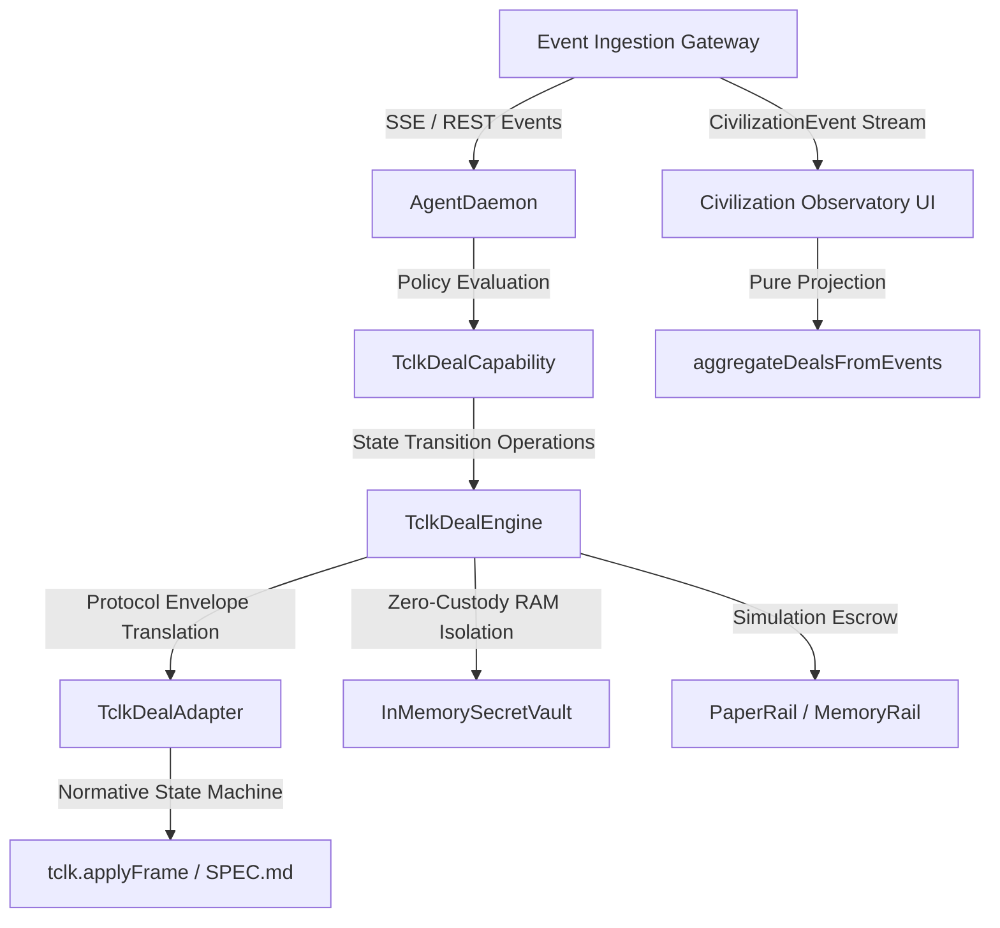

# Phase 13.6: TCLK/1 Final Hardening, Spec Conformance & Audit

## 1. System Architecture & Boundaries

The Phase 13 integration establishes a clean, layer-separated architecture connecting the Technocore multi-agent civilization framework to the normative `@flop-labs/tclk` (v0.1.0) protocol:



---

## 2. Normative TCLK/1 Conformance

The implementation directly delegates state machine progression to `@flop-labs/tclk` `applyFrame()`:

* **`OFFER`**: Canonical parameter validation (`amount`, `asset`, `lock`, `rails`, monotonic deadlines where $\text{expiresMs} \le \text{claimByMs} < \text{refundAfterMs}$). Computes canonical `offerId`.
* **`ACCEPT`**: Role verified to be counterparty. Statement validated against lock kind. Derives canonical 32-byte hex `contractId`.
* **`LOCK`**: Initiator role validated (payer). Terms matched against contract terms. Escrow recorded on configured rehearsal rail.
* **`REVEAL`**: Secret validated against statement ($H = \text{sha256}(S)$). Verifies claim occurs strictly before $\text{refundAfterMs}$. Transitions state to `claimed`.
* **`REFUND`**: Permitted strictly at or after $\text{refundAfterMs}$. Releases locked escrow and transitions to `refunded`.
* **`CANCEL`**: Permitted strictly prior to `locked` status. Transitions state to `cancelled`.
* **`RECEIPT`**: Permitted strictly from terminal states (`claimed`, `refunded`, `cancelled`).

---

## 3. Security Invariants & RAM-Only Isolation

```text
               ┌───────────────────────────────┐
               │    Generating Agent Process   │
               │                               │
               │   ┌───────────────────────┐   │
               │   │ InMemorySecretVault   │   │
               │   │  (RAM-Only Isolation) │   │
               │   └──────────┬────────────┘   │
               │              │                │
               │      Secret Preimage S        │
               │      (Never Serialized)       │
               └──────────────┼────────────────┘
                              │
                    Preimage Withheld
                              │
                              ▼
┌─────────────────────────────────────────────────────────────┐
│               Public Civilization Network                   │
│                                                             │
│   Statement Hash H = sha256(S)                              │
│   (Public Ledger / Observatory View / Network Broadcaster)  │
└─────────────────────────────────────────────────────────────┘
```

1. **Zero-Custody RAM Vault**: Unrevealed secret preimages reside solely within in-memory `InMemorySecretVault`. They are NEVER serialized to disk, database, remote network frames, or public events prior to the reveal phase.
2. **Observatory Redaction**: Prior to reveal, UI displays `🔒 HIDDEN UNTIL REVEAL` and only presents the public statement hash $H$.
3. **Fail-Closed Cold-Start Crash**: If an agent process crashes before revealing, the lost RAM secret cannot be reconstructed. Subsequent reveal attempts fail closed with `TclkSecretNotFoundError`, allowing the counterparty to safely refund escrow upon timelock expiry.

---

## 4. Hostile Input & Fail-Closed Behavior

Every incoming message, frame string, and civilization event is validated as untrusted input:
* **Malformed JSON / Nonce Replay**: Dropped cleanly without state mutation.
* **Out-of-Order Transitions** (e.g. reveal before lock, refund before timelock, lock after cancel): Rejected with typed errors (`TclkStateTransitionError`).
* **Unauthorized Role Actions**: An unauthorized party attempting to lock, cancel, or reveal someone else's contract is rejected fail-closed.
* **Cross-Deal Isolation**: Malformed or failing frames in Deal $A$ do not affect or contaminate concurrent Deal $B$.

---

## 5. Multi-Deal Concurrency & Fault Isolation

Tested with 5 simultaneous, interleaved deals with distinct parties, amounts, and settlement rails:
* Independent state tracking per contract ID.
* Cancellation of Deal $A$ or timelock refund of Deal $B$ does not interfere with the success of Deal $C$.
* Duplicate event syncs are idempotent and do not spawn phantom deals.

---

## 6. Rail Safety & Rehearsal Status

* **Non-Value Settlement**: `PaperRail` and `MemoryRail` are simulated, non-value-bearing rehearsal mechanisms designed to validate agent choreography and cryptographic commitments.
* **Zero Asset Transfer**: No real fiat, bank tokens, cryptocurrency, or FLOP value is transferred or custody-held.
* **PTLC Limitations**: Point-Time Locked Contracts using Schnorr adaptor signatures are unaudited reference crypto and remain marked experimental.
