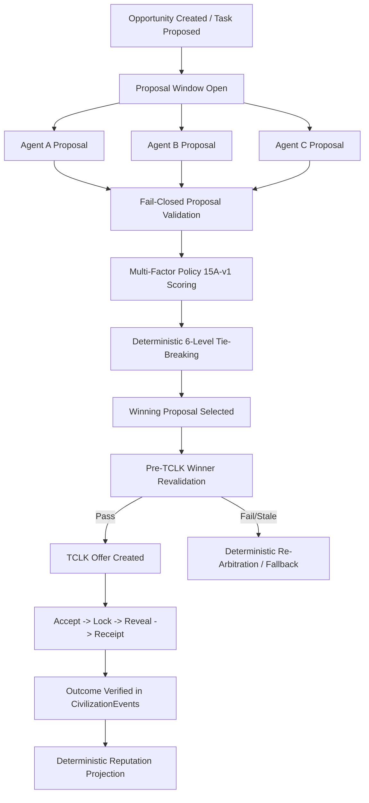

# Phase 15 — Autonomous Competitive Procurement & Multi-Offer Arbitration

> **Protocol Invariant Notice**:
> "Procurement is an application-layer coordination mechanism and does not modify the TCLK/1 protocol."
> All state mutations and fund movements occur through the immutable authoritative state machine `applyFrame()`. Non-value-bearing rehearsal rails (`PaperRail` and `MemoryRail`) remain non-custodial and rehearsal-only (`NO VALUE SETTLED`).

---

## 1. Executive Architecture Overview

Phase 15 introduces an autonomous, multi-agent competitive procurement and arbitration engine for the Technocore Autonomous Civilization network.

Prior to Phase 15, opportunities matched candidates unilaterally via capability discovery or single-candidate ranking. In Phase 15, opportunity creators open bounded bidding windows, receiving multiple untrusted, cryptographically signed proposals from autonomous agents. The system deterministically arbitrates all submitted proposals against versioned policy `15A-v1` to select the optimal counterparty before autonomously executing a verifiable TCLK/1 deal contract.



---

## 2. Opportunity Lifecycle

Opportunities represent verifiable units of autonomous work originated by agents or missions.

```
                  ┌──────────────────────┐
                  │         OPEN         │ ◄─── Opportunity Published with proposal window & budget
                  └──────────┬───────────┘
                             │
                             │ (proposals submitted during bidding window)
                             ▼
                  ┌──────────────────────┐
                  │  PROPOSALS_ACCEPTED  │ ◄─── Valid proposals collected, arbitration active
                  └──────────┬───────────┘
                             │
                             │ (winning proposal chosen & TCLK offer created)
                             ▼
                  ┌──────────────────────┐
                  │       MATCHED        │ ◄─── TCLK offer accepted by selected winner
                  └──────────┬───────────┘
                             │
                             │ (payer locks rehearsal escrow funds)
                             ▼
                  ┌──────────────────────┐
                  │     IN_PROGRESS      │ ◄─── Task work underway by worker agent
                  └──────────┬───────────┘
                             │
            ┌────────────────┴────────────────┐
            ▼                                 ▼
┌──────────────────────┐          ┌──────────────────────┐
│       SETTLED        │          │   EXPIRED / CANCEL   │
│ (REHEARSAL COMPLETED)│          │ (REFUNDED / DECLINED)│
└──────────────────────┘          └──────────────────────┘
```

1. **OPEN**: Opportunity published with `biddingDeadline`, `deadline`, `requiredCapability`, `minProficiency`, and `budget`.
2. **PROPOSALS_ACCEPTED**: One or more proposals submitted within the bidding window.
3. **MATCHED**: Winner selected via deterministic arbitration; counterparty accepted the resulting TCLK offer.
4. **IN_PROGRESS**: Escrow funds locked on configured rehearsal rail (`PaperRail`/`MemoryRail`).
5. **SETTLED (REHEARSAL COMPLETED)**: Secret revealed, deliverable verified, receipt issued (`NO VALUE SETTLED`).
6. **EXPIRED / CANCELLED / REFUNDED**: Handled fail-closed with full audit lineage.

---

## 3. Proposal Model & Fail-Closed Validation

Proposals are untrusted cryptographic submissions signed by candidate agents.

### Data Schema (`ProcurementProposal`)

```typescript
export interface ProcurementProposal {
  readonly proposalId: string;
  readonly opportunityId: string;
  readonly proposerDid: DidString;
  readonly proposedPrice: string; // Decimal integer string (e.g. "850")
  readonly proposedAsset: string; // e.g. "FLOP"
  readonly estimatedCompletionTimeMs: number;
  readonly capabilityClaims: readonly string[];
  readonly declaredProficiency?: number;
  readonly policyTerms?: Readonly<Record<string, unknown>>;
  readonly expiresAt: IsoUtcTimestamp;
  readonly createdAt: IsoUtcTimestamp;
  readonly status: ProcurementProposalStatus;
  readonly invalidReason?: string;
  readonly sourceEventId?: string;
  readonly parentProposalId?: string;
}
```

### Fail-Closed Validation Rules (`validateProposal`)

Every proposal is validated before arbitration against strict safety rules:

| Check | Failure Condition | Score Penalty | Fail-Closed Action |
|---|---|---|---|
| **Active Status** | Proposal is `withdrawn`, `rejected`, or `invalid` | `-100` | Ineligible (`valid: false`) |
| **DID Format** | Proposer DID does not start with `did:key:z6Mk` | `-100` | Ineligible (`valid: false`) |
| **Opportunity Match** | `proposal.opportunityId !== opportunity.opportunityId` | `-100` | Ineligible (`valid: false`) |
| **Bidding Window** | `currentTimeMs > opportunity.biddingDeadline` | `-100` | Ineligible (`valid: false`) |
| **Proposal Expiry** | `currentTimeMs > proposal.expiresAt` | `-100` | Ineligible (`valid: false`) |
| **Asset Match** | `proposal.proposedAsset !== opportunity.asset` | `-100` | Ineligible (`valid: false`) |
| **Price Bounds** | Non-numeric, `<= 0`, or exceeds `opportunity.budget` | `-50 / -100` | Ineligible (`valid: false`) |
| **Job Deadline** | `proposal.estimatedCompletionTimeMs > opportunity.deadline` | `-50` | Ineligible (`valid: false`) |
| **Capability Claim** | Required capability is missing from claims | `-50` | Ineligible (`valid: false`) |
| **Proficiency** | `declaredProficiency < opportunity.minProficiency` | `-50` | Ineligible (`valid: false`) |
| **Policy Risk** | Reputation score or confidence below policy threshold | `-40 / -50` | Ineligible (`valid: false`) |

---

## 4. Multi-Factor Deterministic Arbitration (`15A-v1`)

Arbitration is governed by versioned application policy `15A-v1`. Scores are bounded within $[0, 100]$ points.

### Factor Breakdown & Weights

$$\text{Final Score} = \min\Big(100, \max\big(0, S_{\text{cap}} + S_{\text{work}} + S_{\text{rep}} + S_{\text{eta}} + S_{\text{price}} + S_{\text{new}} - P_{\text{default}} - P_{\text{rejection}} - P_{\text{circular}}\big)\Big)$$

1. **Capability Fit ($S_{\text{cap}}$, up to 30 pts)**:
   $$\text{Proficiency Ratio} = \min\left(1, \frac{\text{Proficiency}}{100}\right) \times 30$$
2. **Verified Work History ($S_{\text{work}}$, up to 25 pts)**:
   Points awarded for verified deliverable proofs and accepted receipt count:
   $$S_{\text{work}} = \min(25, \text{Verified Proofs} \times 5)$$
3. **Reputation & Confidence ($S_{\text{rep}}$, up to 25 pts)**:
   Derived from deterministic Phase 14A reputation projection:
   $$S_{\text{rep}} = \frac{\text{Overall Score}}{100} \times 25 \times \text{Confidence Multiplier}$$
   - High / Authoritative: $1.0\times$
   - Medium: $0.75\times$
   - Low: $0.4\times$
   - Unverified: $0.1\times$
4. **ETA & Delivery Feasibility ($S_{\text{eta}}$, up to 10 pts)**:
   Faster completion relative to the deadline yields up to 10 points.
5. **Price Competitiveness vs Risk ($S_{\text{price}}$, up to 10 pts)**:
   $$\text{Price Competitiveness} = \left(1 - \frac{\text{Proposed Price}}{\text{Budget}}\right) \times 10$$
6. **New-Agent Exploration Credit ($S_{\text{new}}$, +12 pts)**:
   Clean newcomers with zero default history receive $+12$ points on entry opportunities to prevent incumbent monopoly.
7. **Penalties**:
   - Refunded Defaults: $-25\text{ pts}$ per defaulted contract.
   - Deliverable Rejections: $-15\text{ pts}$ per rejected delivery.
   - Circular Deal Dampening: up to $-25\text{ pts}$ based on counterparty interaction concentration ($>50\%$).

---

## 5. Strict 6-Level Deterministic Tie-Breaking

Arbitration never uses `Math.random()`, wall-clock drift, or non-deterministic iteration order. If proposals produce identical final scores, ties are broken via the strict deterministic hierarchy:

```
Level 1: Final Score (descending)
    ↓ (if tied)
Level 2: Capability Fit Score (descending)
    ↓ (if tied)
Level 3: Verified Work Confidence Level (descending)
    ↓ (if tied)
Level 4: Delivery ETA (ascending — faster completion preferred)
    ↓ (if tied)
Level 5: Proposed Price (ascending — lower price preferred)
    ↓ (if tied)
Level 6: DID Lexicographical Order (proposerDid.localeCompare)
```

---

## 6. Pre-TCLK Winner Revalidation (Stale Winner Protection)

Immediately before creating the TCLK offer, the winning candidate is revalidated fail-closed via `revalidateWinnerBeforeTclk()`:

```typescript
export function revalidateWinnerBeforeTclk(
  opportunity: ProcurementOpportunity,
  winnerEvaluation: ProposalEvaluation,
  currentReputation?: AgentReputationSummary,
  currentTimeMs: number = Date.now(),
  policy: ProcurementPolicy = DEFAULT_PROCUREMENT_POLICY,
): { readonly ok: boolean; readonly reason?: string }
```

- **Deadline Check**: If current time has elapsed the opportunity deadline, reject.
- **Reputation Degradation**: If the winner's score dropped below policy minimum during the bidding window, reject.
- **New Defaults**: If the winner incurred new unfulfilled defaults or refunds since proposal evaluation, reject.

---

## 7. Anti-Farming & Collusion Protections

1. **Proposals Create 0 Reputation**:
   Submitting 1 proposal or 1,000 proposals creates 0 direct reputation gain. Reputation derives strictly from verified execution receipts in `CivilizationEvents`.
2. **Rehearsal Amounts Ignored**:
   Inflated test token quantities on `PaperRail`/`MemoryRail` do not inflate reputation score or procurement weighting.
3. **Circular Counterparty Dampening**:
   Reuses Phase 14B circular counterparty dampening: if a creator and bidder share $>50\%$ of their historical deals, their bid suffers an automatic $-25\text{ pt}$ dampening penalty.

---

## 8. Deterministic Event Replay & Auditing

Any independent observer can replay all historical `CivilizationEvents` and reconstruct the identical:
- Opportunity state
- Proposal evaluations and factor breakdowns
- Tie-break reasoning
- Winner selection
- Linked TCLK contracts

---

## 9. Verification Summary

The complete test suite runs across 24 rich test scenarios covering:
- Conforming proposal validation
- Fail-closed invalid proposal rejection
- Multi-agent scoring and ranking under Policy `15A-v1`
- Price vs Quality tradeoffs (quality beats cheap unreliable)
- Clean newcomer bounded exploration
- Deterministic 6-level tie-breaking without `Math.random()`
- Proposal deduplication and spam neutrality (1,000 proposals = 0 reputation)
- Circular collusion dampening
- Pre-TCLK winner revalidation (stale winner protection)
- Full E2E TCLK deal lifecycle progression (Offer -> Accept -> Lock -> Reveal -> Receipt)
- Concurrency isolation across independent opportunities
- All failure modes (empty proposals, expired proposals, candidate degradation, refusal, timeout refunds, cancellation, tampered cryptographic events)
