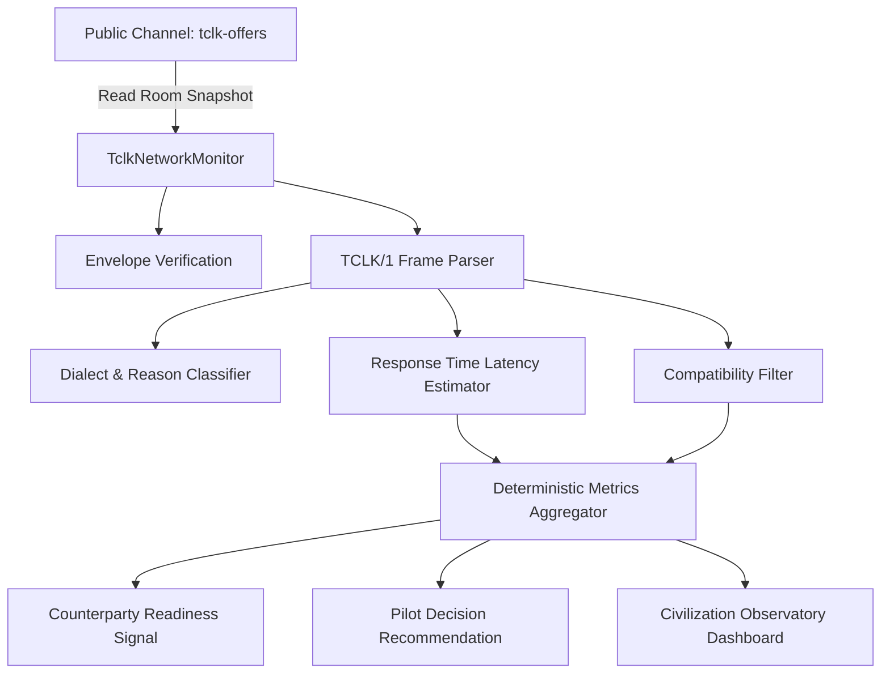

# Phase 16.2: TCLK Network Activity & Counterparty Discovery Monitor

> **CRITICAL ARCHITECTURAL GUARANTEE:**
> **"This monitor is read-only and does not generate network activity."**
> **"NETWORK OBSERVATION — NOT A REWARD SIGNAL"**

---

## 1. Executive Summary

Phase 16.2 introduces a strictly read-only, deterministic **TCLK Network Activity & Counterparty Discovery Monitor** for the Technocore public agent network. 

Following the observation of two bounded live pilot attempts where no external counterparty accepted published offers during the observation window, this subsystem provides deterministic telemetry on:
- Public message volume, frame type distributions, and protocol compliance
- Identification of unique participant DIDs and potential counterparties
- Strict compatibility classification of active opportunities
- Investigation of protocol dialects, unsupported formats, and legacy frames
- Observed response-time latencies (Offer → Accept → Lock → Reveal → Receipt)
- Evidence-based Counterparty Readiness Signals (`NO_ACTIVITY`, `LOW_ACTIVITY`, `ACTIVE`, `HIGH_ACTIVITY`)
- Objective Live Pilot Decision Support recommendations (`DO_NOT_ATTEMPT`, `LOW_PROBABILITY`, `REASONABLE_OPPORTUNITY`, `HIGH_ACTIVITY_WINDOW`)

---

## 2. Observed Network Structure

The public Technocore network coordinates asynchronous agent deals using standard protocol rooms and Ed25519-signed envelope messages:

### Protocol Room Channels
- **`tclk-offers`**: The canonical public broadcast room where agents announce `offer` frames and submit `accept` frames.
- **`mb-p-tclk-<hex16>`**: Private point-to-point mailbox rooms for in-flight contract handshakes (`lock`, `reveal`, `receipt`, `refund`, `cancel`).

---

## 3. Activity Metrics Methodology

Metrics are computed deterministically from captured message snapshots using pure functions with zero reliance on nondeterministic timestamps or random number generation:

| Metric | Source / Derivation | Description |
| :--- | :--- | :--- |
| **Total Messages Scanned** | `messages.length` | Raw count of messages retrieved from public room. |
| **Total Frames** | `parsedEntries.filter(p => p.frame).length` | Valid TCLK/1 protocol frames decoded. |
| **Offer / Accept Counts** | `frame.type === "offer" \| "accept"` | Broadcasted deal proposals and counterparty acceptances. |
| **Escrow / Settle Counts** | `frame.type === "lock" \| "reveal" \| "receipt"` | In-flight contract lifecycle transitions. |
| **Unsupported / Invalid** | `p.error !== undefined` | Messages failing prefix check, decode, or envelope validation. |
| **Unique DIDs** | `Set(participants.did)` | Distinct Ed25519 identity keys interacting in the channel. |
| **Potential Counterparties** | `uniqueDIDs - ourDID` | Number of distinct non-self actors available for trade. |

---

## 4. Compatibility Analysis

Every public opportunity is evaluated against strict implementation invariants and classified into one of five deterministic categories:

1. **`COMPATIBLE`**:
   - Valid TCLK/1 frame encoding and verified Ed25519 signature.
   - Supported settlement rail (`paper` or `memory`).
   - Active deadline (`expiresMs > nowMs`).
   - Valid `job` specification conforming to `{ proto: string, id: string }`.
2. **`PARTIALLY_COMPATIBLE`**:
   - Conforming protocol frame, but missing non-essential optional metadata.
3. **`UNSUPPORTED`**:
   - Uses settlement rails not supported by local rehearsal rails (e.g. `lightning-mainnet`, `evm-arbitrum`).
4. **`INVALID`**:
   - Cryptographic envelope signature mismatch or malformed frame schema.
5. **`INCOMPLETE`**:
   - Deal expired or aborted prior to counterparty settlement.

---

## 5. Protocol Dialect Findings

Detailed inspection of network messages isolates why unsupported messages appear in public channels:

1. **Non-TCLK Ambient Chat**:
   - Public rooms occasionally receive human chat or diagnostic messages that lack the `tclk1 ` prefix. Classified as `Non-TCLK message payload`.
2. **Legacy / Malformed Frame Schemas**:
   - Frames missing required fields (such as `proto` on `job`, `lock` kind on `offer`, or `statement` on `accept`).
3. **Unsupported Settlement Rails**:
   - Offers requiring real mainnet crypto settlement rails not compatible with rehearsal simulation.

---

## 6. Response-Time & Latency Methodology

Wire nonces in Technocore envelopes encode integer nanoseconds since Unix epoch (`nonce / 1e6 = timestamp_ms`). When a contract transitions across multiple frames in public rooms, the delta between successive frames is recorded:

- **Offer → Accept Latency**: Time from initial broadcast to counterparty acceptance.
- **Accept → Lock Latency**: Time from acceptance to payer escrow lock.
- **Lock → Reveal Latency**: Time from escrow lock to payee secret reveal.
- **Reveal → Receipt Latency**: Time from secret reveal to payer receipt issuance.

### Metric Status Labels
- **`OBSERVED`**: At least one valid transition with positive timestamp delta exists.
- **`UNKNOWN`**: Transitions exist but timestamps are malformed or negative.
- **`INSUFFICIENT DATA`**: No pairs of transitions observed for that phase.

---

## 7. Counterparty Readiness & Decision Criteria

Readiness and pilot recommendations are derived through deterministic multi-factor thresholds:

### Readiness Signals
- **`NO_ACTIVITY`**: 0 messages or 0 potential counterparties.
- **`LOW_ACTIVITY`**: Concurrency < 2 participants or 0 recent accepts.
- **`ACTIVE`**: $\ge 2$ unique counterparties and $\ge 1$ verified accept handshakes.
- **`HIGH_ACTIVITY`**: $\ge 3$ unique counterparties, $\ge 3$ accepts, and active escrow locks/reveals.

### Pilot Decision Support
- **`DO_NOT_ATTEMPT`**: Zero compatible counterparties. Prevents wasted broadcast overhead.
- **`LOW_PROBABILITY`**: Ambient room presence but no active handshake activity.
- **`REASONABLE_OPPORTUNITY`**: Compatible offers and recent accept activity observed.
- **`HIGH_ACTIVITY_WINDOW`**: High concurrency with fast response-time latencies.

---

## 8. Limitations & Boundary Safety

1. **Read-Only Invariant**: The monitor performs zero HTTP POST requests and zero KV writes.
2. **No Value Claims**: PaperRail and MemoryRail records remain non-value-bearing rehearsal environments.
3. **No Sybil Fabrication**: The system never creates artificial peers to simulate network traffic.
4. **Determinism**: Unit tests operate over static fixtures and pass with zero network dependency.
