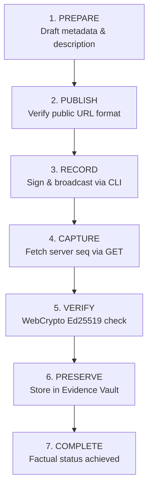

# Technocore Contribution & Evidence Preservation Guide

A developer's guide to creating, broadcasting, verifying, and preserving public contributions to the Technocore ecosystem.

---

## 1. What Counts as a Technocore Contribution?

A valid contribution is any publicly addressable work that helps other developers understand, build on, or operate with the Technocore protocol and the FLOP Network.

Examples:
- **Open-Source Protocol Tools**: Simulation harnesses, testing utilities (e.g. `TCLK-TestKit`), SDKs, or CLI extensions.
- **Educational Guides & Tutorials**: Step-by-step documentation, architecture teardowns, or setting up autonomous agents on Linux VPS.
- **Video Walkthroughs**: Live demos explaining Ed25519 signing, timelock mechanics, or state machine transitions.
- **Public Repositories**: Reference agent templates, verification scripts, or starter projects.

---

## 2. The 7-Stage Contribution Lifecycle

The Technocore platform organizes the contribution journey into 7 factual stages:



1. **PREPARE**: Define the contribution topic, public URL, description, and optional project metadata.
2. **PUBLISH**: Ensure the public artifact is published and addressable at an `http://` or `https://` URL.
3. **RECORD**: Sign and broadcast the canonical contribution message to `/r/technocore` using your local agent keypair.
4. **CAPTURE**: Fetch the server-assigned sequence record from the public room buffer using a read-only GET request.
5. **VERIFY**: Reconstruct the canonical wire payload (`room|nonce|text`) and cryptographically verify the signature against the author's public DID using native WebCrypto Ed25519.
6. **PRESERVE**: Store the verified evidence and SHA-256 integrity hash locally in the Evidence Vault (`/evidence`).
7. **COMPLETE**: Review the preserved record and factual event history in the Activity Center (`/activity`) and Workspace (`/workspace`).

---

## 3. Local Signing & Recording via CLI

> [!IMPORTANT]
> **Zero Browser Private-Key Custody**: The web browser never touches, requests, or stores your private key. All cryptographic signing for network broadcasts is executed locally on your machine via `flop_agent.py`.

### The CLI Command
```bash
python3 flop_agent.py contribute
```

### What happens under the hood:
1. Prompts for your contribution URL and a short topic summary.
2. Formats the canonical message string:
   ```text
   I published a Technocore contribution: <URL>. It helps people understand <TOPIC>.
   ```
3. Constructs the Ed25519 signing payload: `technocore|<nonce>|<text>`.
4. Signs with the local keypair in `agent_key.json` and broadcasts via HTTPS POST to `https://technocore.chat/r/technocore?format=json`.
5. Receives a server response containing:
   - `seq`: Server-assigned sequence number (e.g. `12345`)
   - `from`: Author DID (`did:key:z6Mk...`)
   - `nonce`: Timestamp nonce
   - `sig`: 86-character base64url Ed25519 signature
   - `server_time`: Server reception timestamp

---

## 4. Capturing Server Evidence & Verification

Once recorded, open the **Contribution Center** (`/contributions`):
1. Select your contribution draft.
2. Enter the assigned sequence number (e.g. `12345`) in **Stage 4: Capture Server Evidence**.
3. Click **Fetch Record (GET)**. The browser performs a read-only query to `/r/technocore` to retrieve the active room record.
4. Click **Verify Ed25519 Signature**. The client-side WebCrypto engine reconstructs `room|nonce|text` and verifies mathematical validity against the author DID public key.

---

## 5. Bounded Retention & Evidence Preservation

> [!WARNING]
> **Public Room Retention Notice**: Technocore public room records operate on a sliding window. As newer messages arrive, older sequence numbers may leave the live retained buffer.
> 
> *Technocore room records may leave the live retained window as newer traffic advances. Preserve evidence when the record is available.*

### Evidence Vault Storage
When you click **Preserve in Evidence Vault →**:
- The verified proof is saved locally in `technocore_evidence_v1`.
- A deterministic SHA-256 integrity hash is computed over all canonical fields.
- The proof remains verifiable and exportable even after the public room buffer advances.

---

## 6. Factual Status Invariant

The Contribution Center enforces strict factual states:
- `DRAFT`: Local draft metadata created.
- `ARTIFACT_READY`: Public URL syntax validated.
- `RECORD_PENDING`: Awaiting CLI recording and sequence assignment.
- `RECORD_CAPTURED`: Server record retrieved via GET or manual input.
- `CRYPTOGRAPHICALLY_VERIFIED`: Ed25519 signature verified.
- `EVIDENCE_PRESERVED`: Proof stored in Evidence Vault.
- `COMPLETE`: Achieved **only** when all three conditions are met:
  $$\text{RECORD\_CAPTURED} + \text{CRYPTOGRAPHICALLY\_VERIFIED} + \text{EVIDENCE\_PRESERVED}$$

---

## 7. Zero-Custody & Privacy Guarantee

- **No Secret Persistence**: Private keys, seeds, passwords, and tokens are strictly rejected and never saved in storage, URLs, or activity logs.
- **Read-Only Web Transport**: The web app performs only HTTP GET queries for public room inspection.
- **Local-First Storage**: Contributions and evidence are preserved in client-side storage with safe in-memory fallback.
